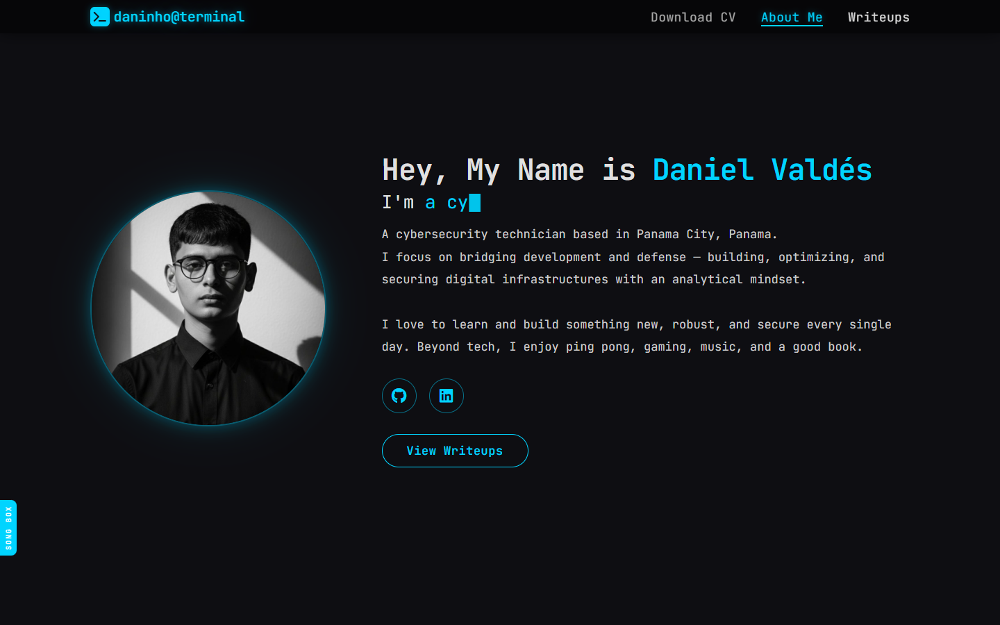
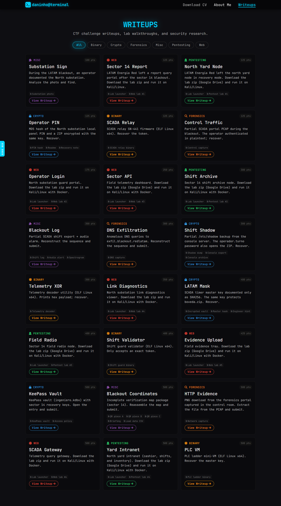
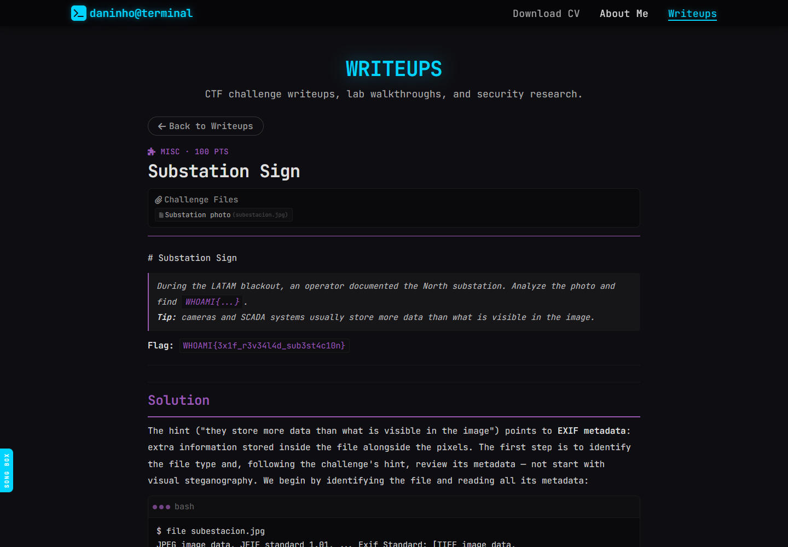
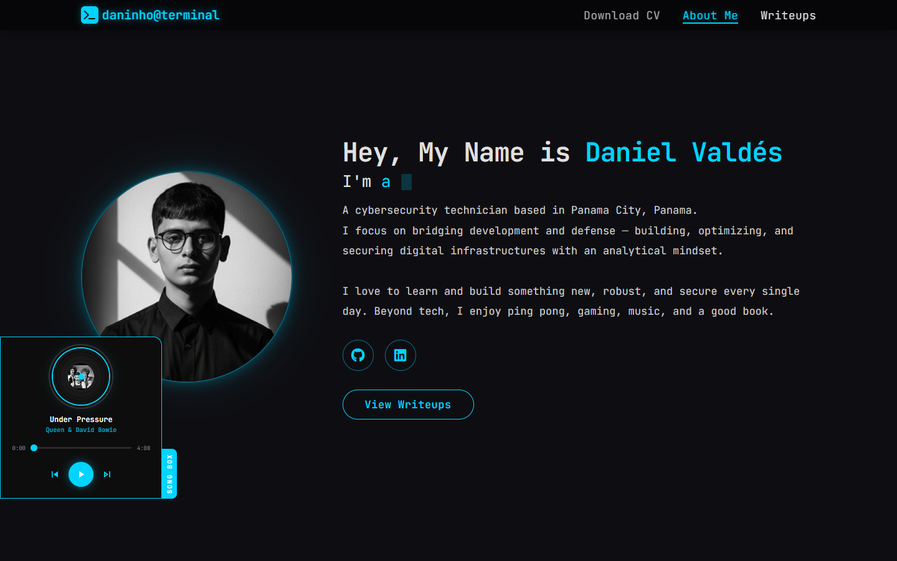

<p align="center">
  
</p>

<h1 align="center">Daniel Valdés — Portfolio</h1>

<p align="center">
  <b>Cybersecurity technician · Panama City, Panama</b><br/>
  A terminal-themed personal portfolio with CTF writeups and a built-in music player.
</p>

<p align="center">
  
  
  
  
  
</p>

<p align="center">
  <a href="https://danielvaldess.github.io/"><b>Live site</b></a> ·
  <a href="https://danielvaldess.github.io/writeups/">Writeups</a> ·
  <a href="https://linkedin.com/in/daniel--valdes">LinkedIn</a> ·
  <a href="https://github.com/danielvaldess">GitHub</a>
</p>

---

## What is it?

My personal portfolio as a cybersecurity technician. It has three parts:

- **About me** — who I am, what I do, and a downloadable CV.
- **Writeups** — **24 CTF/lab writeups** across 6 categories (Web, Pentesting,
  Crypto, Forensics, Binary, Misc), filterable and rendered from Markdown.
- **Song Box** — a slide-in music player with album art and controls.

It is a **fully static site** — no framework, no build step — deployed to
**GitHub Pages** with GitHub Actions.

## Screenshots

**Home / About me** — terminal-style branding, animated typing effect and social links.



**Writeups** — filter by category and browse 24 writeups with points and lab files.



**A writeup** — the Markdown is fetched and rendered in-page, with a back button.



**Song Box** — a slide-in music player with disc animation, progress bar and controls.



## Features

- Terminal-themed UI (`daninho@terminal`) with a monospace typeface.
- Animated typing effect and responsive layout (mobile menu included).
- **24 writeups** in 6 categories, filterable, loaded on demand from Markdown.
- Per-writeup metadata: category, points and referenced lab files.
- **Song Box**: a music player with cover art, seek bar and playback controls.
- One-click CV download (`documents/DV_CV.txt`).
- Continuous deployment to GitHub Pages on every push to `main`.

## How it works

```
index.html            Home / About (typing effect, social links, CV)
style.css             Global styles (terminal theme, responsive)
writeups/
  index.html          Writeups page: filters + in-page viewer
  *.md                24 writeup documents
scripts/
  writeups.js         WRITEUPS metadata (title, category, points, files, slug)
  songs.js            Song Box player + SONGS list
songs/                Audio tracks + cover art
images/               Profile picture, avatar, favicon
documents/DV_CV.txt   Downloadable CV
.github/workflows/pages.yml   GitHub Pages deployment
```

- **Writeups:** the page reads the `WRITEUPS` array in `scripts/writeups.js`, builds
  the cards and filters, and fetches the matching `writeups/<slug>.md` on demand,
  rendering it client-side.
- **Song Box:** `scripts/songs.js` injects the player into the page and reads the
  `SONGS` array for tracks and covers.
- **Deploy:** `.github/workflows/pages.yml` uploads the repository as a static
  artifact and publishes it to GitHub Pages.

## Adding content

**A new writeup**

1. Create `writeups/<slug>.md`.
2. Add an entry to `WRITEUPS` in `scripts/writeups.js`:
   ```js
   { id: "<slug>", title: "Title", category: "Web", points: 250,
     slug: "<slug>", files: ["startlab.sh", "blackout-web01.tar"],
     desc: "Short description." }
   ```
3. Push — the card appears automatically.

**A new song**

1. Drop the `.mp3` and its cover in `songs/`.
2. Add an entry to `SONGS` in `scripts/songs.js`:
   ```js
   { src: "/songs/track.mp3", cover: "/songs/track.jpg",
     title: "Track", artist: "Artist" }
   ```

## Local preview

Because writeups are fetched at runtime, serve the folder over HTTP (not `file://`):

```bash
python -m http.server 8000
# open http://localhost:8000
```

## Deployment

Push to `main` — the GitHub Actions workflow builds the Pages artifact and
publishes it automatically.

## Author

**Daniel Valdés** — Cybersecurity technician based in Panama City, Panama.

[LinkedIn](https://linkedin.com/in/daniel--valdes) · [GitHub](https://github.com/danielvaldess)

---

<p align="center"><sub>Personal project · © Daniel Valdés</sub></p>
